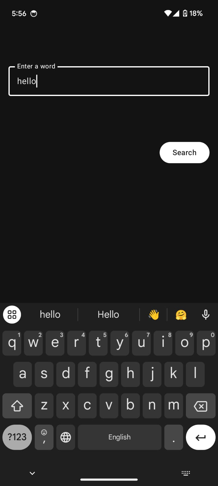

# Dictionary Application

A dictionary application built with Kotlin, Jetpack Compose, and following Clean Architecture principles. The app allows users to search for words and view their definitions, pronunciations, and other relevant details. It also supports offline access to previously searched words and handles errors gracefully.

## Table of Contents

- [Architecture](#architecture)
- [Tools and Libraries Used](#tools-and-libraries-used)
- [Features](#features)
- [Screenshots](#screenshots)
- [Getting Started](#getting-started)

## Architecture

The application is designed following the Clean Architecture principles with a multi-module setup, which separates the project into different layers:

1. **Presentation Layer**: Contains UI code built with Jetpack Compose. This layer includes `ViewModel` classes to manage UI-related data and states using `State` and `LiveData`.
   
2. **Domain Layer**: Holds the business logic of the app. It includes use cases that interact with the repository interfaces to fetch or manipulate data. The domain layer is independent of any other layers, making it reusable and testable.

3. **Data Layer**: Manages data operations. It contains implementations of repository interfaces, data sources (both remote and local), and Room entities for local database storage. Retrofit is used for network calls, and Room is used for local caching.

### Module Structure

- **app**: The main entry point for the application, includes the `MainActivity` and app-wide components.
- **data**: Contains the implementations for data handling, such as the `Repository` and `DataSource` classes, Room database setup, and Retrofit API service.
- **domain**: Contains the domain models, use cases, and repository interfaces.

## Tools and Libraries Used

- **Kotlin**: The programming language used to develop the application.
- **Jetpack Compose**: Modern toolkit for building native Android UI.
- **Room**: For local storage and offline access to previously searched words.
- **Retrofit**: For making network requests to the Dictionary API.
- **Coroutines**: For handling asynchronous tasks.
- **Hilt**: Dependency injection library for managing dependencies across the application.
- **Material3**: For implementing Material Design components in the UI.
- **Gson**: For parsing JSON data from the API responses.

## Features

- Search for word definitions and other details.
- Offline availability for previously searched words.
- Graceful handling of network and other errors.
- Follows Clean Architecture principles for maintainable, testable, and scalable codebase.

## Screenshots

| Home Screen                                      | Word Details Screen                                 |
| ------------------------------------------------ | --------------------------------------------------- |
|        |  |

## License

This project is licensed under the MIT License - see the [LICENSE](LICENSE) file for details.
